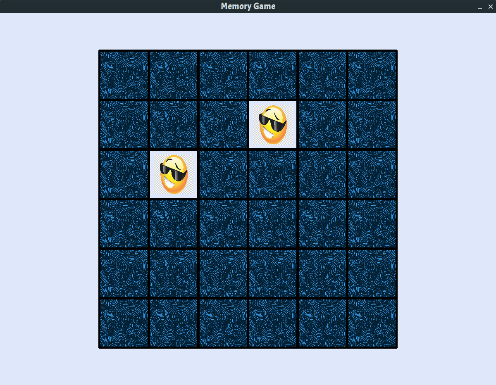

# Emoji Memory Game

This is an emoji-based memory tile game. The objective is to find and match all the correct sets of similar tiles scattered across the board. To see the game in action, follow the steps below to set it up on your machine or refer to the Wiki (https://github.com/sreeharshau/memory-game-python/wiki) for more screenshots.



# Deployment Steps
## Prerequisites
This game requires Python 3.7+ in order to run. Pip is also recommended to enable easy installation of the required package dependencies.

#### Install pygame and playsound
```
pip install pygame
pip install playsound
```
## Clone the Repository
Use the repository link provided by Github
```
git clone <repo-link>
```
## Running the code
- **Note**: Please do not move out __ImagePaths.cfg__ or __cardBackground.jpg__ from the same directory as __gameMain.py__
```
python3 gameMain.py
```
# Configurable Parameters
- Various parameters such as the game screen size, tile size and colors are configurable and can be changed by changing the relevant lines at the top of the code in __gameMain.py__
- Additional Sprites can be used by adding a label to describe them as well as their file paths into __ImagePaths.cfg__
- The face-down card background can be changed by renaming the required file to __cardBackground.jpg__ and placing it in the same directory as __gameMain.py__
- The correct and incorrect match sounds can be changed by replacing the mp3 files with the required tones

